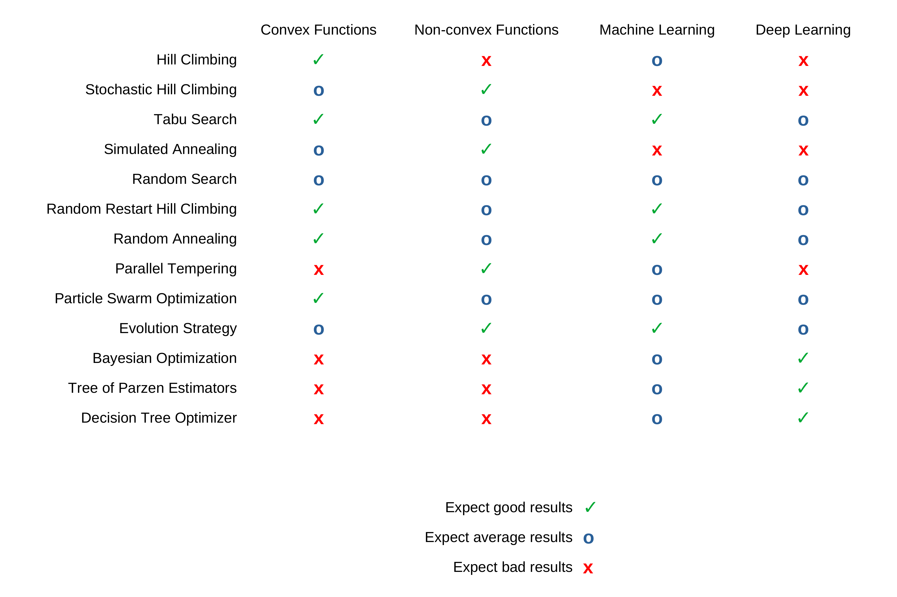

<h1 align="center"> 
  Optimization Tutorial
</h1>

Tutorials for the optimization techniques used in Gradient-Free-Optimizers and Hyperactive. This includes:

  - Hill Climbing
  - Stochastic Hill Climbing
  - Tabu Search
  - Simulated Annealing
  - Random Search
  - Random Restart Hill Climbing
  - Random Annealing
  - Parallel Tempering
  - Particle Swarm Optimization
  - Evolution Strategy
  - Bayesian Optimization
  - Tree of Parzen Estimators
  - Decision Tree Optimizer

 

## Overview

The following table shows the expected results for each optimization strategy for the given type of problems:

    - Convex function with fast evaluation time (<0.1s)
    - Non-convex function with fast evaluation time (<0.1s)
    - Machine learning model hyperparameter optimization
    - Deep learning model hyperparameter optimization

   
  
   

Those recomendations are just estimated based on personal experience and can heavily change dependend on optimization parameters, exact type of problem and number of iterations.

