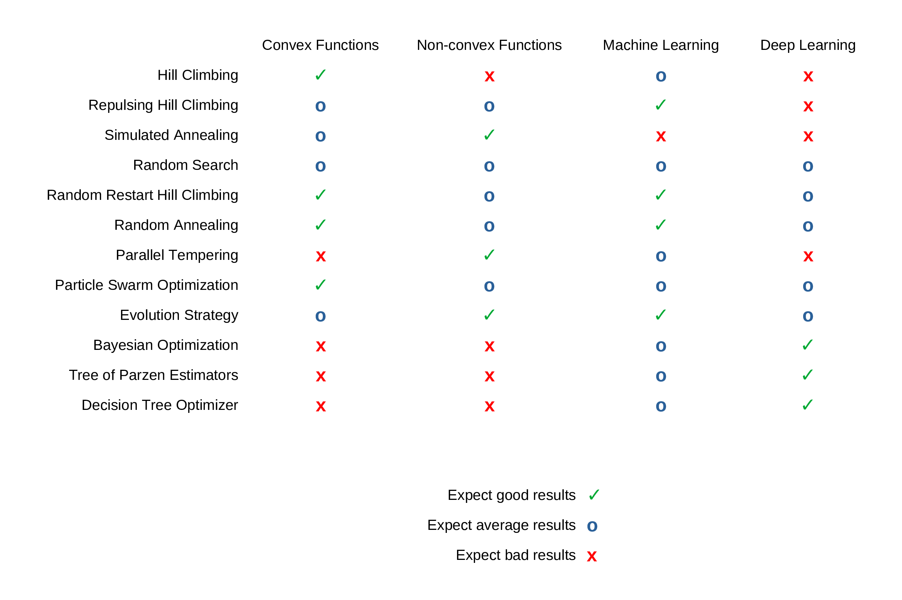

<h1 align="center"> 
  Optimization Tutorial
</h1>

This tutorial describes the optimization strategies and paramters from the Hyperactive and Gradient-Free-Optimization python-packages. 

 

---

  <h3>
    <a href="https://github.com/SimonBlanke/Hyperactive#overview">Overview</a> •
    <a href="https://github.com/SimonBlanke/Hyperactive#optimizer-classes-and-default-parameters">Optimizers</a> •
    <a href="https://github.com/SimonBlanke/Hyperactive#optimizer-parameters">Parameters</a>
  </h3>

---

 

## Overview

The following table shows the expected results for each optimization strategy for the given type of problems:

    - Convex function with fast evaluation time (<0.1s)
    - Non-convex function with fast evaluation time (<0.1s)
    - Machine learning model hyperparameter optimization
    - Deep learning model hyperparameter optimization

   
  
   

Those recomendations are just estimated based on personal experience and can heavily change dependend on optimization parameters, exact type of problem and number of iterations.

 

## Optimizer Classes and default Parameters

<b> HillClimbingOptimizer</b>

  
 
  
Hill climbing is a very basic optimization technique, that explores the search space only localy. It starts at an initial point, which is often chosen randomly and continues to move to positions with a better solution. It has no method against getting stuck in local optima.

**Available parameters:**
  - epsilon=0.05
  - distribution="normal"
  - n_neighbours=3
  - rand_rest_p=0.03

**Use case/properties:**
  - Never as a first method of optimization
  - When you have a very good initial point to start from
  - If the search space is very simple and has few local optima or saddle points

<b> RepulsingHillClimbingOptimizer</b>

  
 
  
  
**Available parameters:**
  - epsilon=0.05
  - distribution="normal"
  - n_neighbours=3
  - rand_rest_p=0.03
  - repulsion_factor=3

**Use case/properties:**
  - When you have a good initial point to start from

<b> SimulatedAnnealingOptimizer</b>

 

Simulated annealing chooses its next possible position similar to hill climbing, but it accepts worse results with a probability that decreases with time:

  

It simulates a temperature that decreases with each iteration, similar to a material cooling down. The following normalization is used to calculate the probability independent of the metric:

  

**Available parameters:**
  - epsilon=0.05
  - distribution="normal"
  - n_neighbours=3
  - rand_rest_p=0.03
  - p_accept=0.1
  - norm_factor=1
  - annealing_rate=0.975
  - start_temp=1

**Use case/properties:**
- When you have a good initial point to start from, but expect the surrounding search space to be very complex
- Good as a second method of optimization

<b> RandomSearchOptimizer</b>

 

The random search explores by choosing a new position at random after each iteration. Some random search implementations choose a new position within a large hypersphere around the current position. The implementation in hyperactive is purely random across the search space in each step.

**Use case/properties:**
  - Very good as a first method of optimization or to start exploring the search space
  - For a short optimization run to get an acceptable solution

<b> RandomRestartHillClimbingOptimizer</b>

 

Random restart hill climbing works by starting a hill climbing search and jumping to a random new position after a number of iterations.

**Available parameters:**
  - epsilon=0.05
  - distribution="normal"
  - n_neighbours=3
  - rand_rest_p=0.03
  - n_iter_restart=10

**Use case/properties:**
  - Good as a first method of optimization
  - For a short optimization run to get an acceptable solution

<b> RandomAnnealingOptimizer</b>

  
 

An algorithm that chooses a new position within a large hypersphere around the current position. This hypersphere gets smaller over time.

**Available parameters:**
  - epsilon=0.05
  - distribution="normal"
  - n_neighbours=3
  - rand_rest_p=0.03
  - annealing_rate=0.975
  - start_temp=1

**Use case/properties:**
  - Disclaimer: I have not seen this algorithm before, but invented it myself. It seems to be a good alternative to the other random algorithms
  - Good as a first method of optimization
  - For a short optimization run to get an acceptable solution

<b> ParallelTemperingOptimizer</b>

 

Parallel Tempering initializes multiple simulated annealing searches with different temperatures and chooses to swap those temperatures with the following probability:

**Available parameters:**
  - n_iter_swap=10
  - rand_rest_p=0.03

**Use case/properties:**
  - Not as dependend of a good initial position as simulated annealing
  - If you have enough time for many model evaluations

<b> ParticleSwarmOptimizer</b>

 

Particle swarm optimization works by initializing a number of positions at the same time and moving all of those closer to the best one after each iteration.

**Available parameters:**
  - inertia=0.5
  - cognitive_weight=0.5
  - social_weight=0.5
  - temp_weight=0.2
  - rand_rest_p=0.03
  - 
**Use case/properties:**
  - If the search space is complex and large
  - If you have enough time for many model evaluations

<b> EvolutionStrategyOptimizer</b>

 

Evolution strategy mutates and combines the best individuals of a population across a number of generations without transforming them into an array of bits (like genetic algorithms) but uses the real values of the positions.

**Available parameters:**
  - mutation_rate=0.7
  - crossover_rate=0.3
  - rand_rest_p=0.03

**Use case/properties:**
  - If the search space is very complex and large
  - If you have enough time for many model evaluations

<b> BayesianOptimizer</b>

 

Bayesian optimization chooses new positions by calculating the expected improvement of every position in the search space based on a gaussian process that trains on already evaluated positions.

**Available parameters:**
  - gpr=gaussian_process["gp_nonlinear"]
  - xi=0.03
  - warm_start_smbo=None
  - rand_rest_p=0.03

**Use case/properties:**
  - If model evaluations take a long time
  - If you do not want to do many iterations
  - If your search space is not to big

<b> TreeStructuredParzenEstimators</b>

 

Tree of Parzen Estimators also chooses new positions by calculating the expected improvement. It does so by calculating the ratio of probability being among the best positions and the worst positions. Those probabilities are determined with a kernel density estimator, that is trained on alrady evaluated positions.

**Available parameters:**
  - gamma_tpe=0.5
  - warm_start_smbo=None
  - rand_rest_p=0.03

**Use case/properties:**
  - If model evaluations take a long time
  - If you do not want to do many iterations
  - If your search space is not to big

<b> DecisionTreeOptimizer</b>

    - tree_regressor="extra_tree"
    - xi=0.01
    - warm_start_smbo=None
    - rand_rest_p=0.03

 

## Optimizer Parameters

