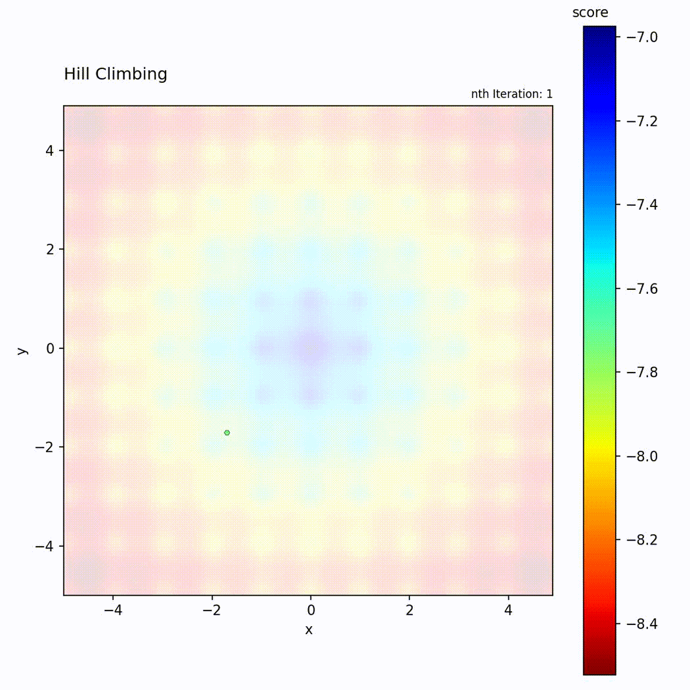
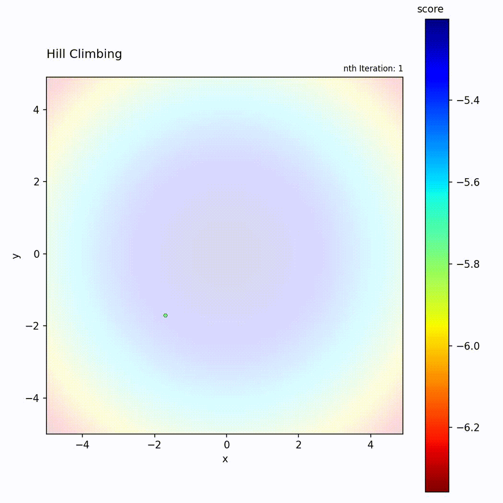

# Hill Climbing

## Introduction

## Explanation

### Pseudo Code

## Parameters

### Epsilon

### N-Neighbours

### Distribution

## Visualization

{: style="height:42vh"}
{: style="height:42vh"}
